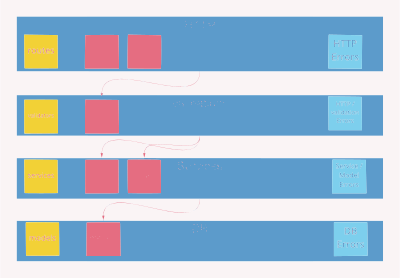

# BE-Challenge
<p align="center">
    
</p>

## Run
### dev env
Prerequisite: 
 - python3
 - mkvirtualenvwrapper

Run  
`` ./local.sh``

### docker env
Prerequisite: 
  - Docker
  - Docker Compose 

Run
``./make.sh``


## Webserver structure

<p align="left">
    
</p>

## Introduction ## 

Congratulations on making it to the challenge stage of the interview process! 

This challenge is designed to test your Software Enigneering skills, in particular back end servers. 

It will likely take 2-3 hours total.  If you find it's taking longer than that, just wrap up what you have and finish off with some pseudo-code to explain what you would do next. Seeing how you prioritize under time restrictions is really useful too.

After you complete this challenge we will have a meeting where you can discuss your approach, and you can share your results, thoughts and ideas. 

This challenge mimics the type of work we do at Nory, and so it should give you a sense of what the day-to-day is like.

## **Challenge Overview**

After designing the user journey, your product manager Jake decided that the next feature to be released will be to show customers their total sales.

Jake understands what the customer wants and what the product needs, but doesn't necessarily know what data looks like or what the api responses should look like. 

So you've had a meeting where he shares what he needs in plain English. 

He showed you the data that was collected so far in the following format:

<p align="left">
    
</p>

On a different place there is also a mapping between branch names to branch ids:

Branch Name | Branch ID 
--- | --- |
| Nory Taco |	2hg8j32gw8g |
| Nory Pizza | 345hngydkgs |
| Nory Sushi |	352h67i328fh |


Jake explained that each customer would like to see their total sales over several days periods or zoom into every day and see the breakdown. 

It's up to you to interpret how to get the correct api responses, and what those responses should look like.

That said, one of the Front End engineers on your team, Lucy, was at the meeting, and has advised what the api endpoints should be called, and what requests to them will contain. 

After some discussion, it was decided there are to be two endpoints: `/daily` and `/hourly`.

For each of these endpoints, Lucy wants to be able to send a GET request with the query parameters `"branch_id"`, `"from"` and `"to"` (`"from"` and `"to"` both being dates in the format `"yyyy-mm-dd"`). 

A sample GET request that will hit your api is shown below:
`https://nory/revenue?from=2021-02-04&to=2021-02-10&branch_id=352h67i328fh`

If she can send GET requests with these parameters to those endpoints, and get the data that she needs, then she is happy to take it from there.

From the meeting you know what each of these endpoints should do.

Name | Function 
--- | --- |
| /hourly | This endpoint will only ever be called when the end user is in "day view". In other words, the start date and end date will always be the same. This endpoint should return the revenue for each hourly slot in the day. So for example, all the orders between 13:00 and 13:59 contribute towards a single hourly slot, and all the orders between 14:00 and 14:59 contribute towards a single hourly slot. ||
| /daily | This endpoint will be called when the end user is inspecting a branch's sales performance. They might be looking at the sales across a day, a week or even a month. This endpoint should return the total revenue across the period. The response should return the total for each day, and also the response should return the total for the full period.||

## The Task
Your goal is to set up the endpoints that receive requests with specified query parameters and return responses with the required data in the format that you decide on.

The application should 
* Return correct responses for the provided data 
* Be Dockerized 
* Store data on a production level DB 

### Resources

Luckily for you, there is a template flask application that your teammate Sadu has created and that you can use, available in this repo. 

#### Setup 
For running locally run
```shell
mkvirtualenv bec --python=python3.9
pip install -r requirements/base.txt
cd revenue && flask db init && flask db migrate && flask db upgrade
flask run
```
The local application will be exposed on `http://0.0.0.0:5000/`


To build a docker image
```shell
docker build -t revenue .
docker run -dp 3000:3000 revenue
```

The dockerized application will be exposed on `http://0.0.0.0:3000/`

Note, that there is a sqlite DB configured to run with the application. If you build the docker application before changing the DB, you should run the db migrations before building the image. 

### Data
Available in the data folder

### Tips 

The provided flask app is to help you speed things up - if you are used to another framework or structure, feel free to change that. 

Think about edge cases. For example, what do you do when the user requests a week's data, but there's no data available for that week?

Things change fast at Nory. You never know when you'll get some additional requirements to fulfil. Think about how to design the api so that it can be upgraded down the line.

Some useful information has been intentionally left out. For example, we gave a sample GET request, but not a sample response. We're super interested to find out how you approach deciding what the response should look like.


## **What We'll Talk About in the Call**

Once you've completed the challenge let us know and will set up a call where we can talk through it. 

We'll ask questions about what approach you took and why. We'll ask questions about what assumptions you might have made, and why.

From there we will also look at the code and hear any decisions that you have made.  

And of course, we want to hear your thoughts and answer any questions you have.

## tl;dr

So that's that. How does it sound? A whole lot of details, we know !

**Oh, and one last thing... best of luck! We're really happy you've decided to take part in the challenge, and we look forward to seeing your epic solution.** 😎


