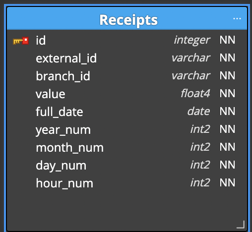

# BE-Challenge

    

## Introduction ## 

Congratulations on making it to the challenge stage of the interview process! 

This challenge is designed to test your ML Engineering skills. 

It will likely take 1, 2 days in total.  If you find it's taking longer than that, just wrap up what you have and finish off with some pseudo-code to explain what you would do next. Seeing how you prioritize under time restrictions is really useful too.

After you complete this challenge we will have a meeting where you can discuss your approach, and you can share your results, thoughts and ideas. 

This challenge mimics the type of work we do at Nory, and so it should give you a sense of what the day-to-day is like.

## **Challenge Overview**

After designing the user journey, your product manager Jake decided that the next feature to be released will be to show customers predictions of their future sales revenue, so they can plan their week.

Jake understands what the customer wants and what the product needs, but doesn't necessarily know what data looks like or what the api responses should look like. 

So you've had a meeting where he shares what he needs in plain English. 

He showed you the data that was collected so far in the following format:

    

On a different place there is also a mapping between branch names to branch ids:

Branch Name | Branch ID 
--- | --- |
| Nory Taco |	2hg8j32gw8g |
| Nory Pizza | 345hngydkgs |
| Nory Sushi |	352h67i328fh |

Jake explained that each customer would like to see the next two weeks' sales forecast. They want to know how many sales and orders they will have on a weekly, daily and hourly basis.

It's up to you to interpret how to get the correct api responses, and what those responses should look like.

That said, one of the Front End engineers on your team, Lucy, was at the meeting, and has advised what the api endpoint should be called, and what requests to them will contain. 

After some discussion, it was decided there is to be one endpoint: `/predict`.

For this endpoint, Lucy wants to be able to send a GET request with the query parameters `"branch_id"`, `"start"` and `"end"` (`"start"` and `"end"` both being dates in the format `"yyyy-mm-dd"`). 

A sample GET request that will hit your api is shown below:
`https://nory/precit?start=2021-02-04&end=2021-02-10&branch_id=352h67i328fh`

If she can send GET requests with these parameters to those endpoints, and get the data that she needs, then she is happy to take it from there.

## The Task

Your challenge is to predict the next two weeks' sales forecasting using real customer data, and serve the model via an api. But, we're super interested in your skillset as a machine learning engineer, so we have a restriction: __we want you to use neural networks to make your predictions__.

We're interested in the full process, from EDA, through to experimenting and then validation of results. 

But of course, no model is useful without inference. We have provided you the skeleton of a BE web application hosted in Docker that can serve HTTP requests. Don't worry too much about the details of the api, like load balancing and security. But we are very interested how you design your endpoints.

So, we'd like you to create an api endpoint (or set of api endpoints) that can serve live inferences from your model.

Feel free to assume that there is some other architecture making sure the version of the model used by the api is up to date; we're not looking for real time training. Just real time inference.

Your task is to train a predictive model that can forecast sales up to two weeks ahead, and deploy this model on the api to accept GET requests for the forecasts.

The application should 
* Return correct responses for the provided data 
* Be Dockerized 
* Store data on a production level DB 

### Resources

There is data in the data folder. 
Luckily for you, your teammate Sadu has created a web service that you can use, available in this repo. 

## Run
### dev env
Prerequisite: 
 - python3
 - mkvirtualenvwrapper

Run  
`` ./local.sh``

The local application will be exposed on `http://0.0.0.0:5000/`

### docker env
Prerequisite: 
  - Docker
  - Docker Compose 

Run

``./make.sh``
The dockerized application will be exposed on `http://0.0.0.0:3000/`

## DB Schema

    

### Tips 

The provided flask app is to help you speed things up - if you are used to another framework or structure, feel free to change that. 

Think about edge cases. For example, what do you do when the user requests a week's data, but there's no data available for that week?

Things change fast at Nory. You never know when you'll get some additional requirements to fulfil. Think about how to design the api so that it can be upgraded down the line.

Some useful information has been intentionally left out. For example, we gave a sample GET request, but not a sample response. We're super interested to find out how you approach deciding what the response should look like.

## **What We'll Talk About in the Call**

Once you've completed the challenge let us know and will set up a call where we can talk through it. 

We'll ask questions about what approach you took and why. We'll ask questions about what assumptions you might have made, and why.

From there we will also look at the code and hear any decisions that you have made.  

And of course, we want to hear your thoughts and answer any questions you have.

## tl;dr

So that's that. How does it sound? A whole lot of details, we know !

**Oh, and one last thing... best of luck! We're really happy you've decided to take part in the challenge, and we look forward to seeing your epic solution.** 😎

